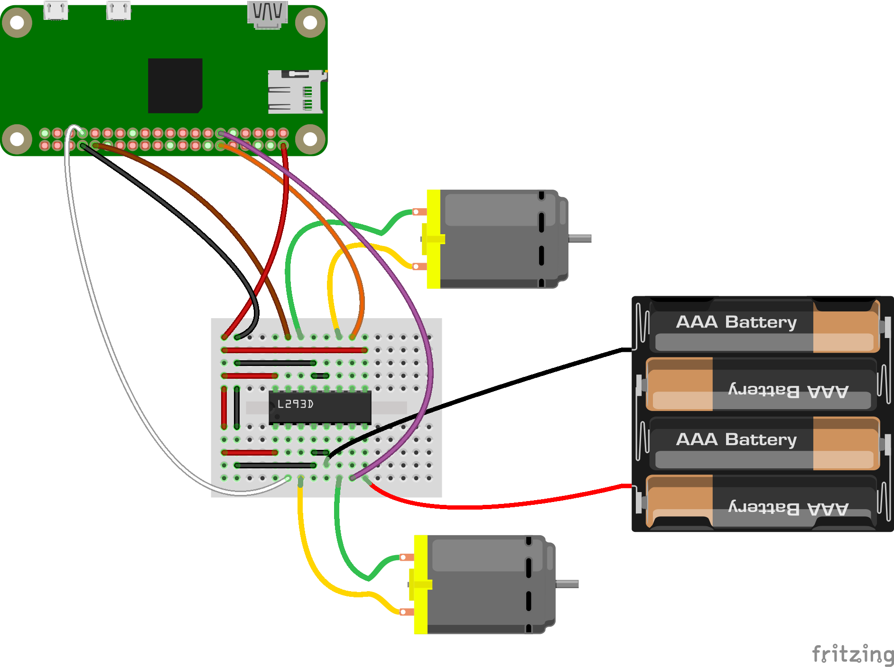

# PiBot

## Parts

Amount | Part Type                           | Properties
------ | ----------------------------------- | ------------------------------------------------------------------------------------
1      | L293D                               | package THT; variant L293D
2      | DC Motor                            |
1      | Raspberry Pi Zero                   | variant Raspberry Pi Zero; processor Broadcom BCM2835 ARMv11; revision RPI-Zero-V1.1
1      | 4 x AAA Battery Mount or 9v Battery | voltage 4.8V
* (Note) The L293D motor driver chip can handle voltages up to 36V if you require more power. More about it [here](http://www.ti.com/lit/ds/symlink/l293.pdf)

## Setting up

## Running the program

* `git clone https://github.com/denvereezy/PiBot.git`
* `cd PiBot`
* `npm install`
* `sudo node app.js` (must run with sudo)
* Open your Browser to `http://localhost:8080`
